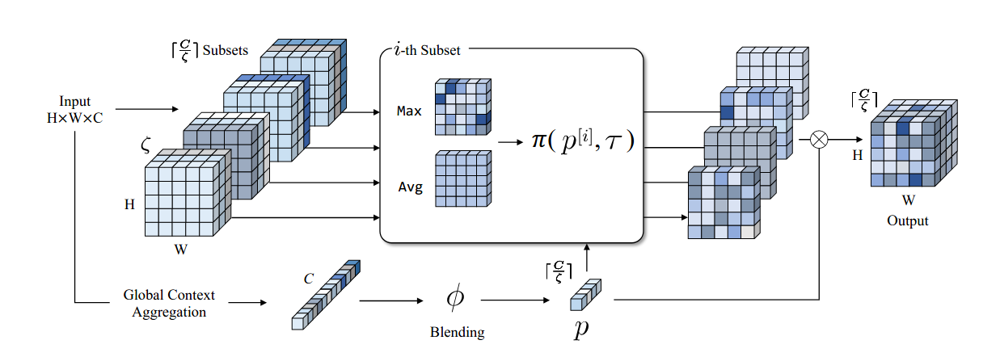
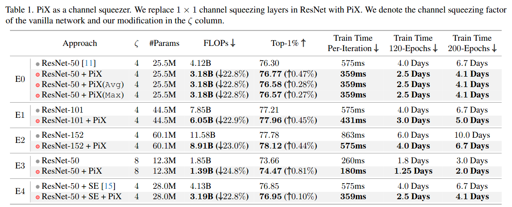

# PiX: Dynamic Channel Sampling for ConvNets
<p align="left">
<a href="https://" alt="arXiv">
    </a>
</p>


Official PyTorch implementation of **PiX** in **CVPR 2024**, from the following paper:\
[PiX: Dynamic Channel Sampling for ConvNets ](https://)\
[Ashish Kumar](https://ashishkumar822.github.io), [Daneul Kim](https://carpedkm.github.io), [Jaesik Park](https://jaesik.info/), [Laxmidhar Behera](https://scholar.google.co.in/citations?hl=en&user=QWTcyP8AAAAJ)



PiX namely Pick-or-Mix (PiX) is an effective **multi-purpose module** for **dynamic channel sampling**. PiX divides a set of channels into subsets and then picks from them, where the **picking decision is dynamically made per each pixel** based on the input activations. PiX can perform **fast channel squeezing, network downscaling and also can behave as dynamic channel prunner**. In channel squezing mode, after replacing 1 × 1 channel squeezing layers in ResNet with PiX, the network becomes 25% faster without losing accuracy. 


## PiX in Fast Channel Squeezing Mode



## Installation

The results are produced with `torch==1.11.0 and timm 0.9.2`. Other versions might also work.


## Dataset Preparation

Download the [ImageNet-1K](http://image-net.org/) classification dataset and structure the data as follows:
```
/path/to/imagenet-1k/
  train/
    class1/
      img1.jpeg
    class2/
      img2.jpeg
  val/
    class1/
      img3.jpeg
    class2/
      img4.jpeg
```

## Training

Before Training PiX pytorch cuda plugin must be built. Follow the steps below:

```
cd models/layers
python setup.py install
```

Now, you can use the following command to train PiX ResNet-50 on a single 8-GPU machine: 

```
python -m torch.distributed.launch --nproc_per_node=8 \
main.py --model PiXResNet50_cs \
--data_path path_to_imagenet \
--lr 3.5e-3 --weight_decay 0.35  --drop 0.05 \
--opt lamb --aa rand-m7-mstd0.5-inc1 --mixup 0.15 --bce_loss
--output_dir /dir_for_saving_models \
--model_ema true --model_ema_eval true --model_ema_decay 0.99996 
--batch_size 128 
```

- Effective batch size = `--nproc_per_node` * `--batch_size` * `--update_freq`. 

### Acknowledgement

This repository is built using the [timm](https://github.com/rwightman/pytorch-image-models) library, [VanillaNet](https://github.com/huawei-noah/VanillaNet) repositories.

### Citation
If our work is useful for your research, please consider citing:
```
@article{pix,
  title={Pick-or-Mix: Dynamic Channel Sampling for ConvNets},
  author={Kumar, Ashish and Kim, Daneul and Park, Jaesik and Behera, Laxmidhar},
  journal={Computer Vision and Pattern Recognition},
  year={2024}
}
```


